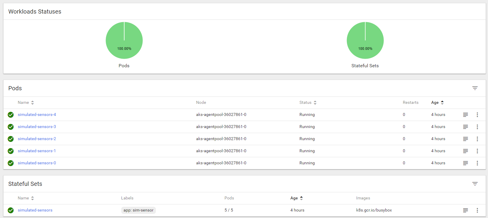
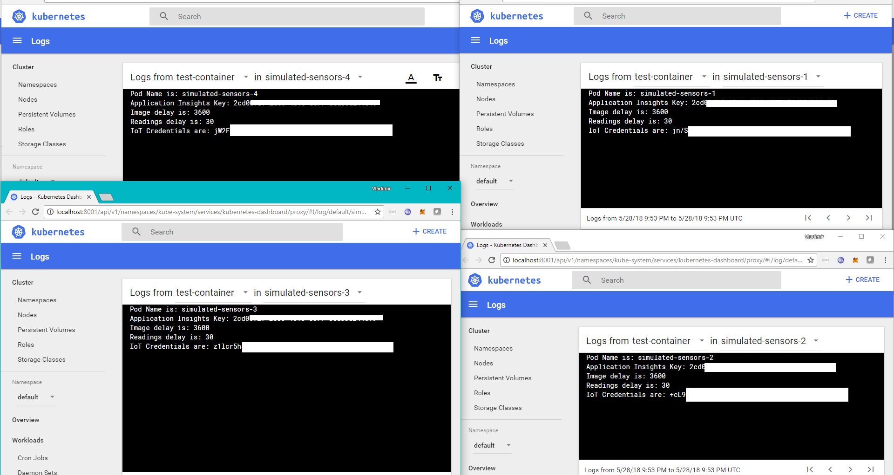
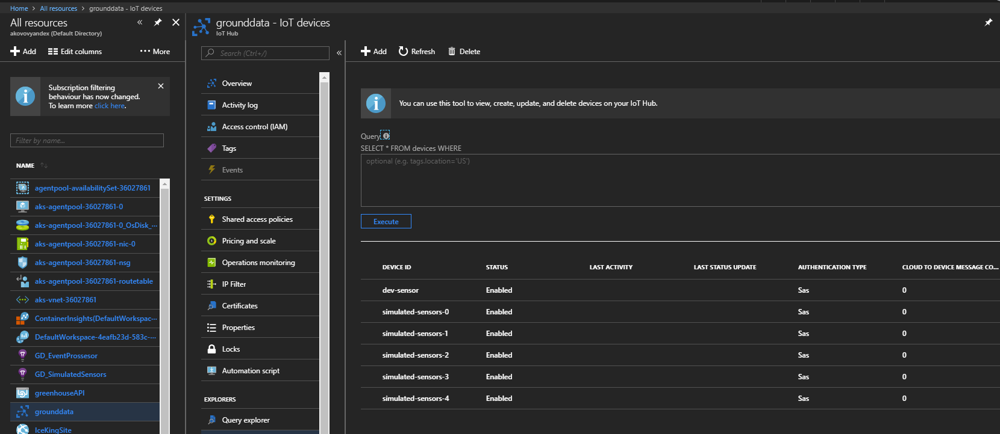
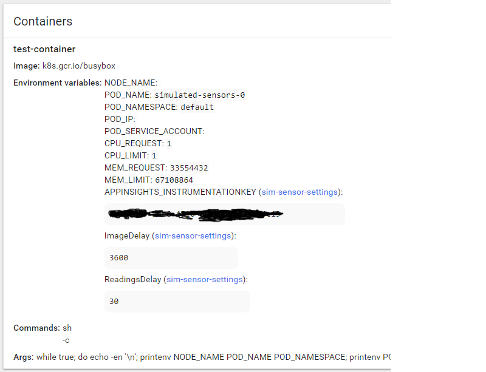

# Simulating IoT devices with Kubernetes
We often need to simulate devices — sensors and vehicles — to test our IoT systems, see how well they manage load, how they deal with errors, etc.
Each simulated device pretends to be an independent entity with it’s own settings i.e. battery level, upload frequency, service outages, persistent memory, etc.

I’ve previously done it in **Azure** using **Webjobs**, and it works if you just need to simulate one or two devices, but it breaks down once you are past that point.

But we found that with **StatefulSets** in **Kubernetes** it’s actually super easy. With it we can manage credentials for hundreds of simulated devices and scale up/down as needed. What we are doing now would be a torture with webjobs.

## What are StatefulSets?
In a normal **ReplicaSet** a pod is temporary, holds no persistent data, has a random name, and if it dies, it will be replaced by a different pod with a different name. 
**StatefulSets** were designed to manage statefull applications that save data on disk. In a StatefulSet pods are numbered 0, 1, 2, 3 … and if one dies, it will be recreated with the same name. They can also be matched with Persistent Volumes to save data to disk, but in this example we don’t actually need to use disk.

## How it works
Each application container is simulating one device. Each pod is numbered and we use that determine which device this pod should simulate. We provide all pods with a list of all credentials — say a hundred of them. The pod will find it’s appropriate credentials in that list and use them to connect to the IoT system and do it’s job.

Below is a definition for a StatefulSet that provides name of the pod to the application as an environmental variable. If you want more pods, you just change the number of replicas in the yaml file.

As long as your list of credentials is large enough, and your cluster has enough capacity, there is no limit to how many completely independent devices you can simulate by just changing one number at any time.

```yaml 
apiVersion: apps/v1
kind: StatefulSet
metadata:
  name: simulated-sensors
spec: 
  replicas: 5
  selector:
    matchLabels:
      app: sim-sensor
  template:
    metadata:
      labels:
        app: sim-sensor
    spec:
      containers:
        - name: test-container
          image: clumsypilot/iotsimulator
          env:
            - name: POD_NAME
              valueFrom:
                fieldRef:
                  fieldPath: metadata.name
```


## Managing Settings and Credentials
Sometimes we want to change settings, for example simulate a high-load situation, by cranking up the data rate on each device. We want to be able to change settings without touching the source. Also we don’t want to store auth credentials in the source, so let’s explain how we do that properly in Kubernetes.

We are using a .Net Core application to simulate devices but i tried to keep it language agnostic as much as possible.

### Put settings in Config Maps
The application will read settings from Environmental Variables, but the best way to manage them is through a **ConfigMap**.
```yaml
apiVersion: v1
kind: ConfigMap
metadata:
  name: sim-sensor-settings
  namespace: default
data:
  APPINSIGHTS_INSTRUMENTATIONKEY: ####
  ReadingsDelay: "30"
  ImageDelay: "3600"
```
Under the data section, add whatever settings you wish to manage. To create this config map for the cluster: `kubectl create -f ConfigMap.yaml` 
Also make changes to the StatefulSet definition as follows:
```yaml
apiVersion: apps/v1
kind: StatefulSet
metadata:
  name: simulated-sensors
spec: 
  replicas: 5
  selector:
    matchLabels:
      app: sim-sensor
  template:
    metadata:
      labels:
        app: sim-sensor
    spec:
      containers:
        - name: test-container
          image: clumsypilot/iotsimulator
          envFrom:
            - configMapRef:
                name: sim-sensor-settings
          env:
            - name: POD_NAME
              valueFrom:
                fieldRef:
                  fieldPath: metadata.name
```
Verify that the settings are being attached to the pod correctly:


## Provide Credentials through Secrets
Secrets are better at storing sensitive data, and as we have a large amount of it, it’s best to provide it as a file, `credentials.json`
```JSON
{
    "Credentials": {
        "simulated-sensors-0": "************",
        "simulated-sensors-1": "************",
        "simulated-sensors-2": "************",
        "simulated-sensors-3": "************",
        "simulated-sensors-4": "************"
    }
}
```
Just like CongfigMaps, secrets are key-value pairs. In the config map we specified each key-value pair individually.In this case the filename is the key, and it’s contents are the “value”. You can have several files in one secret.
``` kubectl create secret generic sim-sensor-credentials --from-file=./credentials.json```
In this case we actually want to provide this information as a file, so we will do that by mounting the secret as a volume. When you do that, each key stored in the secret is represented as a file.
> Paths: linux path starting with s slash, like /secrets/file.json is absolute, whereas secrets/file.json is relative to current application directory. 
```yaml
apiVersion: apps/v1
kind: StatefulSet
metadata:
  name: simulated-sensors
spec: 
  replicas: 5
  selector:
    matchLabels:
      app: sim-sensor
  template:
    metadata:
      labels:
        app: sim-sensor
    spec:
        volumes:
        - name: secrets
          secret:
            secretName: sim-sensor-credentials      
        containers:
        - name: test-container
          image: clumsypilot/iotsimulator
          envFrom:
            - configMapRef:
                name: sim-sensor-settings
          volumeMounts:
          - name: secrets
            mountPath: /secrets
            readOnly: true          
          env:
            - name: POD_NAME
              valueFrom:
                fieldRef:
                  fieldPath: metadata.name
```
Now you can read the file in `/secrets/credentials.json`
 
## Read this data with .Net Core
The easiest way to read this information in .Net is using nuget packages:
```
Microsoft.Extensions.Configuration
Microsoft.Extensions.Configuration.Abstractions
Microsoft.Extensions.Configuration.EnvironmentVariables
Microsoft.Extensions.Configuration.Json
```
They help manage configuration of the application — ConfigutationBuilder creates a dictionary out of data found in config files and environmental variables. Each subsequent .Add will add data to the dictionary, overwriting any values that came in the file before it. We are supplying a file `appsettings.json` to give the application some default and enable testing and building the application on the developer machine without mucking about with environmental variables.
```C#
IConfiguration config = new ConfigurationBuilder()
.AddJsonFile("appsettings.json", optional: true, reloadOnChange: true) /
.AddJsonFile("/secrets/credentials.json", optional: true) 
.AddEnvironmentVariables()
.Build();
```
The secret and environmental variables only come in effect when applicaiton is run in a kubernetes cluster.
```C# 
Console.WriteLine($"Pod Name is: {config["POD_NAME"]}");
Console.WriteLine($"Application Insights Key: {config["APPINSIGHTS_INSTRUMENTATIONKEY"]}");
Console.WriteLine($"Image delay is: {config["ImageDelay"]}");
Console.WriteLine($"Readings delay is: {config["ReadingsDelay"]}");
string devicekeyPath = $"IoTHubCreds:{config["POD_NAME"]}"; 
Console.WriteLine($"IoT Credentials are: {config[devicekeyPath]}");
```
## Debugging
I've built this using alpine container, they are small but don't contain normal bash. You can exec into them using:
`kubectl exec -it simulated-sensors-4 /bin/sh`
